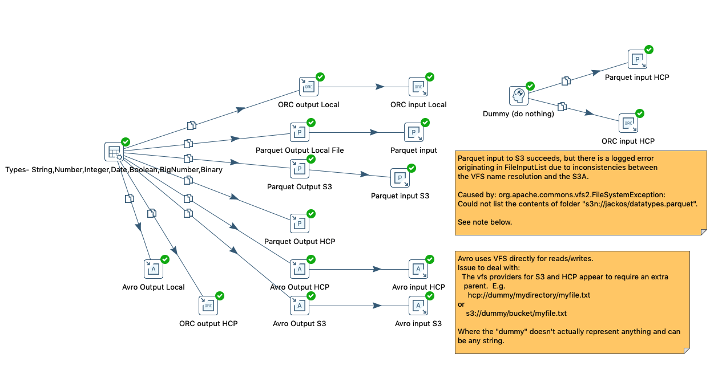

# 9.0:  Big Data Format POC

This shim was developed as an approach to handling 
reading and writing of the big data formats (Parquet, ORC and Avro)
to S3, HCP, and the local filesystem.

Parquet and ORC use the Hadoop Filesystem.  Given that S3 and 
HCP are not a part of named clusters, configuration of these
filesystems requires that we either: 

 1) Incorporate S3/HCP within Named Clusters, _or_
 2) Bridge the VFS configuration of these filesystems to Hadoop.

This POC implements (2).  See the document attached to https://jira.pentaho.com/browse/PDI-18133
for considerations around (1).

## Implementation

In order to minimize impact to existing steps and Format implementations,
this implementation registers a Hadoop Filesystem implementation
for the "pvfs" scheme.  See PvfsHadoopBridge.  This bridge implementation will
only get used if no vendor shim is in context.  For example, if reading/writing to CDH61,
big data format functionality will continue to work as it does in 8.3.

The bridge class will look up the named vfs connection from
the metastore.  For HCP and S3 connections, it will update
the Hadoop Configuration based on the saved vfs connection details,
and with both HCP and S3, it will update the URI to be `s3a:\\`.  
HCP supports the org.apache.hadoop.fs.s3a.S3AFileSystem.

HCP VFS in Pentaho includes an option to "Accept self-signed certificates".
In order to support that option with the Hadoop Filesystem,
this spike implements a `SelfSignedS3ClientFactory`, which 
the bridge will configure S3AFileSystem to use if appropriate. 

The bulk of this POC is in the apache shim implementation.  The only
other changes necessary were to allow format services to be 
retrieved when no named cluster is present.

## TODO
1)  The 'apache' shim currently gets selected only if configured to be the "default shim".
This should be exposed as an independent configuration option.
2)  Pentaho VFS URIs and S3a URIs have an inconsistency.
    Named VFS connections in pentaho expect to have a root part of the
    path that gets ignored.  For example `s3n://s3n/mybucket/myfile`.
    We should find a way to make these consistent, or at least
    forgiving if one or the other path structure gets used.
3)  The apache shim only needs classes for handling format functionality.
    The shim should be skinnied up, removing all unnecessary jars.
4)  Existing logic for dealing with S3 credentials and URI can be removed.
5)  The SelfSignedS3ClientFactory uses com.amazonaws.thirdparty.apache.http.conn.ssl.SSLConnectionSocketFactory,
rather than the apache library directly.  It needs to do this because the aws-java-sdk-bundle
has modified package names for these classes.  If we switch to using the
component libraries, rather than the aws-java-sdk-bundle, we'd need to also
update the SelfSignedS3ClientFactory.
6) Avro format appears to have issues with BigDecimal conversion, unrelated to this POC, but needs follow up.
